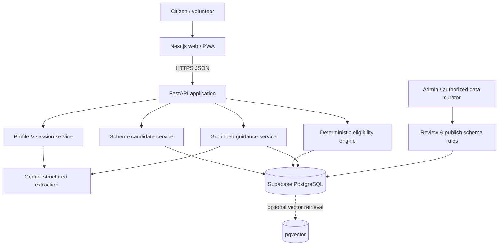

# System design and architecture — Yojana Saathi

## 1. System context

**Goal:** an explainable, source-backed assistant for discovery and application readiness, *not* an official eligibility adjudicator.



## 2. Deployment topology

- **Frontend:** Next.js/TypeScript/Tailwind hosted on Vercel.
- **Backend:** Python 3.12 / FastAPI on Railway (or comparable Python host).
- **Data:** Supabase PostgreSQL with versioned scheme records, documents, rules and evaluations.
- **Model:** Gemini API called **only by the backend**.
- **Observability:** structured request logs without raw sensitive user messages; health endpoint.

## 3. Request lifecycle

1. User enters a free-text description via `/discover`; UI sends it to `POST /api/v1/profiles/extract`.
2. Gemini produces strictly typed JSON. Backend validates/normalizes data and preserves nulls.
3. Citizen reviews/edits extracted facts; backend stores minimal ephemeral session/profile.
4. `POST /api/v1/matches` fetches candidate schemes with safe SQL filters and evaluates published rule versions.
5. Evaluator returns per-rule outcomes `pass|fail|unknown|manual_review`, blocking any false eligibility claim.
6. `POST /api/v1/questions/next` selects the most valuable unknown field from top potential matches; user responds.
7. Match is re-run with new answers; UI displays **why changed**, sources, missing rules.
8. `GET /api/v1/guidance/{scheme_id}` returns verified documents, steps, official application URL; Gemini may *rephrase*, never invent requirements.

## 4. Backend layers

```text
HTTP routers (request/response validation)
  -> application services (extract, match, question, guidance)
    -> domain logic (three-valued rules; ranking; provenance)
      -> repositories (SQL / scheme version / profile session)
        -> PostgreSQL + official-source metadata
```

**Boundary:** Gemini may interpret user language or simplify *already retrieved* official text. It must not output final eligibility boolean or silently edit rules.

## 5. Data quality and knowledge base lifecycle

Official source discovered → human researcher records source URL and update date → schema normalization → second reviewer checks thresholds, exclusions and documents → publish immutable `scheme_version` → test fixtures pass → mark verified. Unreviewed changes remain drafts; stale sources show a banner.

Don't assume a comprehensive public eligibility API exists. Do not scrape restricted portals without authorization. Use manually curated, traceable records for hackathon.

## 6. Rule outcomes and recommendation ranking

- Hard exclusion known to fail → `not_eligible`.
- All required predicates pass + rule set verified → `all_checked_conditions_met`, still **not** official approval.
- Any required predicate unknown, no verified failing condition → `needs_information`.
- Rule non-machine-readable, source conflicting, or stale → `manual_review`.
- Candidate relevance ranking is separate from eligibility. Never describe relevance score as “probability of approval”.

## 7. Source provenance and explainability

Every rule carries a `source_id`, official URL, excerpt or citation locator, a review date, and rule version. User-visible explanations must point back to those records, and unverified guidance must say so.

## 8. Security model

Anonymous citizen sessions by default; no Aadhaar number or identity document upload; strict input length limits; API key server side; DB uses least privilege; admin endpoints require authorized role; rate-limit Gemini endpoints. Delete/expire session data. See [security.md](security.md).

## 9. Failure scenarios

- **Gemini fails/timeouts:** manual fields still available; rule evaluation works without AI.
- **Rule missing:** mark `manual_review`; do not invent a verdict.
- **DB unavailable:** show retry/error, no canned fake recommendations.
- **Official link unavailable:** explain link could not be verified; do not substitute guessed URL.
- **Source changed:** warn verification date and quarantine outdated rule version.

## 10. Architecture decisions

- ADR-01: Use rule engine for decisions instead of LLM due to reproducibility and explainability.
- ADR-02: Start without RAG; add pgvector only if grounded text retrieval demonstrably helps.
- ADR-03: Separate scheme eligibility rule versions from user sessions to enable audit and testing.
- ADR-04: Prefer an accessible responsive web app over native mobile for hackathon scope.
